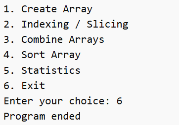

# 🧮 NumPy Analyzer (Python CLI Project)

🚀 A powerful **menu-driven Python application** built using **NumPy** that allows users to perform array operations easily from the command line.

This project is perfect for beginners to understand **NumPy basics**, **array manipulation**, and **data analysis concepts** in a simple and interactive way.

---

## 📌 Project File

📄 Main Program: `numpy analyzer.py` :contentReference[oaicite:0]{index=0}

---

## ✨ Features

✅ Create 1D & 2D Arrays  
✅ Perform Indexing & Slicing  
✅ Combine Multiple Arrays  
✅ Sort Arrays  
✅ Calculate Statistics (Sum, Mean, Median)  
✅ Simple CLI Interface  
✅ Beginner Friendly 💡  

---

## 🛠️ Technologies Used

- 🐍 Python 3
- 🔢 NumPy Library

---

## 📋 Menu Overview

When you run the program, you will see:

Create Array
Indexing / Slicing
Combine Arrays
Sort Array
Statistics
Exit

---

## 📸 Screenshots

### 🖥️ Main Menu

---

### 🧩 Create Array (2D Example)
👉 Create a 2x2 array using user input

---

### ✂️ Indexing / Slicing
👉 Extract specific rows & columns from array

---

### 🔗 Combine Arrays
👉 Merge two arrays using vertical stacking

---

### 🔽 Sort Array
👉 Sort elements in ascending order

---

### 📊 Statistics - Sum
👉 Calculate total sum of elements

---

### 📊 Statistics - Mean
👉 Calculate average value

---

### 📊 Statistics - Median
👉 Find middle value

---

## ⚙️ How It Works

🔹 The program runs in a loop until the user selects **Exit**  
🔹 It stores the array in memory and performs operations on it  
🔹 Uses NumPy functions like:

- `np.array()`
- `reshape()`
- `vstack()`
- `sort()`
- `sum()`
- `mean()`
- `median()`

---
**
---

## 💡 Learning Outcomes

📚 After completing this project, you will understand:

- NumPy array creation 🧱  
- Indexing & slicing 🔍  
- Array operations 🔗  
- Sorting techniques 🔽  
- Basic statistics 📊  

---

## 👨‍💻 Author

**Dhruv Prajapati** 🚀  

---

