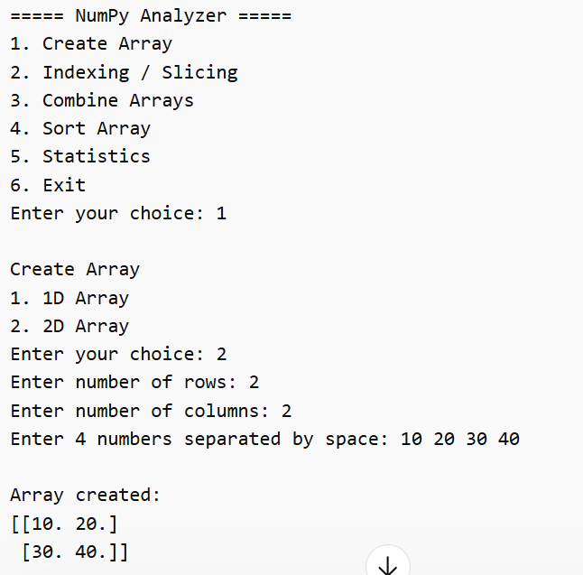
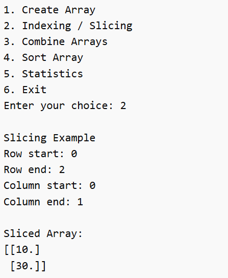
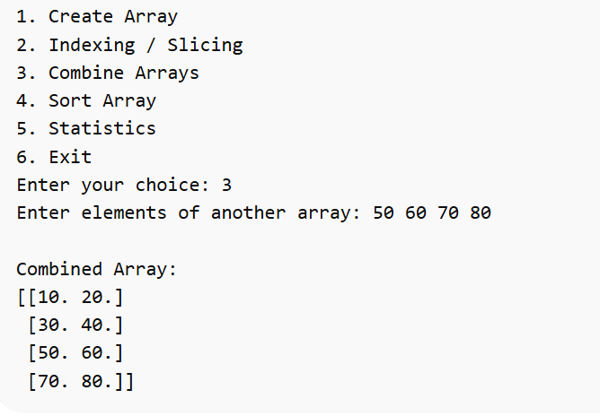
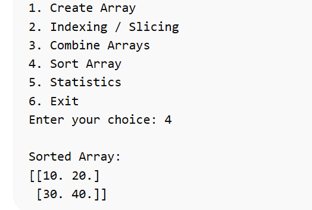
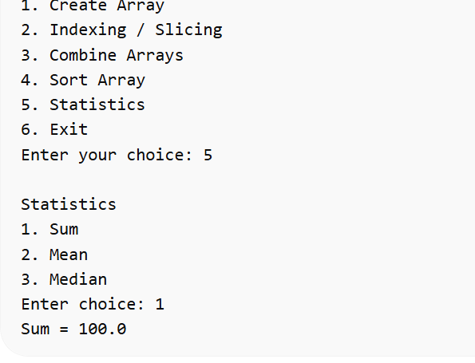
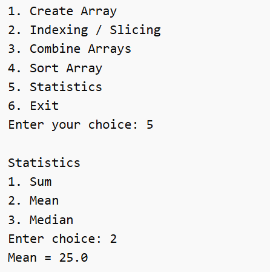
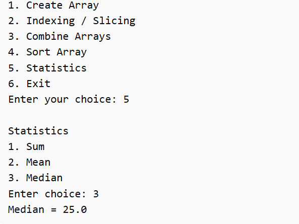

# 🧮 NumPy Analyzer (Python CLI Project)

🚀 A simple and powerful **menu-driven Python application** built using **NumPy** that allows users to perform various array operations interactively.

This project is great for beginners to understand **NumPy**, **array manipulation**, and **basic data analysis** concepts.

---

## ✨ Features

✅ Create 1D & 2D Arrays  
✅ Perform Indexing & Slicing  
✅ Combine Arrays  
✅ Sort Arrays  
✅ Calculate Statistics (Sum, Mean, Median)  
✅ User-friendly CLI interface  

---

## 🛠️ Technologies Used

- 🐍 Python 3  
- 🔢 NumPy  

---

## 📋 Program Menu
===== NumPy Analyzer =====

Create Array

Indexing / Slicing

Combine Arrays

Sort Array

Statistics

Exit

---

## 📸 Screenshots

---

### 🧩 Create Array (2D)
### 🧩 Create Array (2D)

---

### ✂️ Indexing / Slicing

---

### 🔗 Combine Arrays

---

### 🔽 Sort Array

---

### 📊 Statistics - Sum

---

### 📊 Statistics - Mean

---

### 📊 Statistics - Median

---

## ⚙️ How It Works

🔹 User selects options from menu  
🔹 Array is created and stored  
🔹 Operations are performed using NumPy functions  
🔹 Loop continues until user exits  

---

## ▶️ How to Run

1️⃣ Install NumPy:
